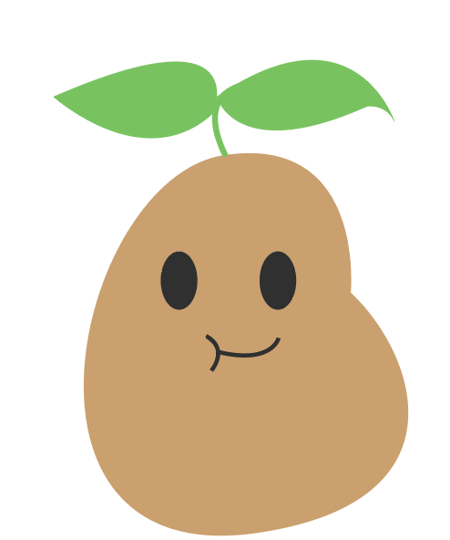

# Elle-Hacks-2023-Sammy

## Inspiration
We were inspired by the servers we are in. Channel texts fly by so quickly it's hard to keep up.

## What it does
- Summarizes Chat Channel of choice
- Generates an image from keywords in the summary
- Analyzes sentiment by giving a negative or positive rating
- Displays a scoreboard from how often individuals chatted

## How we built it
We used Autocode to create the Discord bot. Whenever the command is triggered, the channel's text is sent to either co:here or OpenAI for summarization. This summary is then sent to Stability AI to create an image based on the summary.

## Challenges we ran into
- Using JavaScript with co:here
- Running co:here analysis in Autocode
- Getting a sample data set to summarize

## Accomplishments that we're proud of
- It works most of the time
- If it malfunctions it generates a very funny response

## What we learned
- How to create a Discord bot with Autocode
- Adding dependencies in Autocode
- How to use OpenAI
- How to use Stability AI

## What's next for Sammy
- More sample data for sentiment analysis
- List of top words said

## Requirements
- OpenAI
- Stability AI
- co:here
- Read messages in the chosen channel it's analyzing

## Useful Reference Links
- https://autocode.com/tools/discord/command-builder/
- https://discord.com/developers/applications
- https://autocode-studios.notion.site/Autocode-ElleHacks-2023-b418705c9df84c2e9e34ca99fe99f98f
- https://autocode.com/guides/how-to-build-a-discord-bot/
- https://autocode.com/openai/snippets/cachsnpt_u3EXvKT27Xh1zFEYwJVK4r8KGd68NiMJhUHy/
- https://autocode.com/stabilityai/snippets/cachsnpt_brPPWjXtN7cpeQyLbKPpHjVf7YjiVwThAajq/
- https://autocode.com/discord/api/
